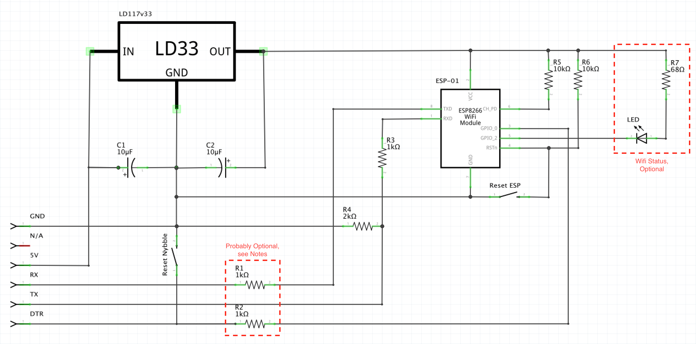

# WIFI Serial Interface for Nybble

***This document is a work in progress and is currently incomplete. The schematic provided likely won't change, but the sections on how to setup the ESP-01 and use it for communicating with Nybble are currently empty.***

In this document, I describe building a wifi-serial bridge for Nybble that plugs into the FTDI serial interface of the NyBoard. This allows you to control your cat over WiFi and push Arduino sketches without having to plug it into your computer with the FTDI cable adapter.

It also uses less power than attaching a Raspberry Pi would (something I will probably do in future experiments).

WiFi connectivity is provided by an ESP8266 ESP-01 flashed with the JeeLabs version of [ESP-Link](http://github.com/jeelabs/esp-link).

*Standard Disclaimer: This document is provided to describe the steps I've taken and that have worked for me. I make no claims as to the fitness of this process or these components or instructions for any purpose; I only claim that this has worked successfully for me.*

### Parts

The links I've included for some of the items are from [Adafruit](https://www.adafruit.com) because sometimes pictures or a source help in identifying things more precisely than just words... I am in no way affiliated with Adafruit, I'm just a happy customer; I also purchase items from many other places, though, so once you know what you need versus what you already have, order from your preferred supplier.

* 1 - ESP8266 ESP-01
    Other ESP8266 variants should work, but we don't need the additional GPIOs or additional flash. The ones I've purchased through Amazon are generally 4 for around $12.00 or so, and have 1MB (8Mbit) of flash, though the ESP-Link software says that it will work with the 512k (4Mbit) versions, so... YMMV
* 1 - small perf/proto-board
    Two that I commonly use for this type of small bridge are the [Quarter-sized Breadboard PCB](https://www.adafruit.com/product/1608) and the [Small Mint Tin Size Breadboard PCB](https://www.adafruit.com/product/1214) -- see pictures later in this document to get an idea of what you prefer for your layout.
* 1 - [LD117v33 Voltage Regulator](https://www.adafruit.com/product/2165)
* 1 - [IDC Breakout, 2x5](https://www.adafruit.com/product/2102)
* 2 - 10uF electrolytic capacitor
    we're only dealing with 5v and 3.3v, so whatever you have lying around (or can get cheaply) should be fine
* 2 - normally-open SPST momentary switch
    I'm partial to [these](https://www.adafruit.com/product/1489) because they are small and fit nicely on most standard pitch perf/proto-boards
* 2 - 10k ohm resistors
* 1 - 2k ohm resistor
* 3 - 1k ohm resistors
    (2 are probably optional, but I include them here because they're on my board, which is the one you'll see in the pictures in this document; see [notes](#Notes) below)
* 1 - 6 pin 0.1" pitch male header
    wherever you get this, it will be [longer](https://www.adafruit.com/product/392); break it off at 6 pins, that's all we need

* Assorted lengths of wire
    I like to "color code" what the wires are used for, so the colors I used are red (positive voltage), black (gnd), yellow (optional), blue (special purpose), white (receive), and green (transmit). But its really up to you and what you have lying around.

Optional
* 1 - 6 pin 0.1" pitch stacking header
    * If you've built Nybble with the `spine` piece (shown in the video for the body when *not* using the Raspberry Pi specific pieces), you'll probably need this to extend the FTDI port high enough to plug this board in.
    * If you have an extra set of stacking headers for an [Arduino UNO R3](https://www.adafruit.com/product/85) lying around, 2 of these are already exactly 6 pins and work perfectly -- this is what I initially used.
    * If not, you can take a [longer stacking header](https://www.adafruit.com/product/3366), pull out the 7th pin from one end with pliers and then use a sharp knife or small saw to cut through the now empty slot to create a 6 pin stacking header. If you're a little picky like me, a small hobby file can be used to smooth the cut edge flush to make it look cleaner.
* 1 - LED, used to indicate WiFi status; I like the low intensity purple of [these](https://www.adafruit.com/product/1793), but really it's up to you.
* 1 - 68 ohm resistor -- only required if you plan to add the LED

### Schematic

### Building the Board

### Notes

* I have used slight variants of this board successfully in a number of personal projects and generally take the approach of "if it works, don't change it, unless its for the better". My reasons for including the 1k resistors on the Reset/DTR and Transmit lines are a result of this. What follows was the thought process, simplistic and probably wrong in some particulars as it may be, that led here:

    The ESP8266 is a 3.3v board and I've generally used it to communicate with 5v boards (Arduino UNO, standalone ATmega 328p designs running at 16Mhz, etc.)... at one point it occured to me that since the 328p is reset when the reset line is pulled to ground, then it's possible that it may briefly output 5v at times, rather than be floating. Likewise the ESP8266's transmit line outputs at 3.3v, but the receive line of the 328p is an input by convention -- you can use it as an output pin, in which case, it could output 5v. To protect the ESP, I set up a voltage divider on both lines, just like the one used for the ESP8266's receive line.

    More experienced readers probably already know where this is going... the 2k resistor used to divide the voltage coming from the 328p's reset line permantly pulled the 328p into a reset state, and the 2k resistor for the ESP's transmit line pulled GPIO 1 low and prevented it from booting up (which actually confuses me, as I thought only GPIOs 0, 2, and 15 are supposed to affect boot mode, but there it is...). Using voltage dividers on these lines is a no-go.

    (I've also tried using a signal diode on the ESP's TX, but that doesn't work either as it has too high of a forward voltage to allow the 3.3v from the E to be seen as HIGH on the 328p's RX; On the reset line it doesn't help either because the flow is from the 328p's reset line to the LOW (GND) state of the ESP -- if the ESP's GPIO 0 were to be in an input state at the wrong instant, it wouldn't be protected anyways.)

    I decided to leave the 1k resistors in-line between the 328p and the ESP because it still works and *may* reduce the current (but not the voltage, unfortunately) of any transitory spikes during the boot process of the 328p before they switch to their roles as reset and RX.

    **If someone with a better understanding of electronics and/or these chips in particular has a better explanation or reason why I should remove the resistors, please let me know; I'm mostly self-taught and welcome the chance to learn from people who know more than I do... these are just my experiences and suspicions and what has worked for me.**

### Flashing and Configuring ESP-Link

### Communicating with Nybble

### Uploading Sketches to Nybble

### License

> The MIT License (MIT)
>
> Copyright (c) 2019 Aaron Magill
>
> Permission is hereby granted, free of charge, to any person obtaining a copy
> of this software and associated documentation files (the "Software"), to deal
> in the Software without restriction, including without limitation the rights
> to use, copy, modify, merge, publish, distribute, sublicense, and/or sell
> copies of the Software, and to permit persons to whom the Software is
> furnished to do so, subject to the following conditions:
>
> The above copyright notice and this permission notice shall be included in
> all copies or substantial portions of the Software.
>
> THE SOFTWARE IS PROVIDED "AS IS", WITHOUT WARRANTY OF ANY KIND, EXPRESS OR
> IMPLIED, INCLUDING BUT NOT LIMITED TO THE WARRANTIES OF MERCHANTABILITY,
> FITNESS FOR A PARTICULAR PURPOSE AND NONINFRINGEMENT. IN NO EVENT SHALL THE
> AUTHORS OR COPYRIGHT HOLDERS BE LIABLE FOR ANY CLAIM, DAMAGES OR OTHER
> LIABILITY, WHETHER IN AN ACTION OF CONTRACT, TORT OR OTHERWISE, ARISING FROM,
> OUT OF OR IN CONNECTION WITH THE SOFTWARE OR THE USE OR OTHER DEALINGS IN
> THE SOFTWARE.
